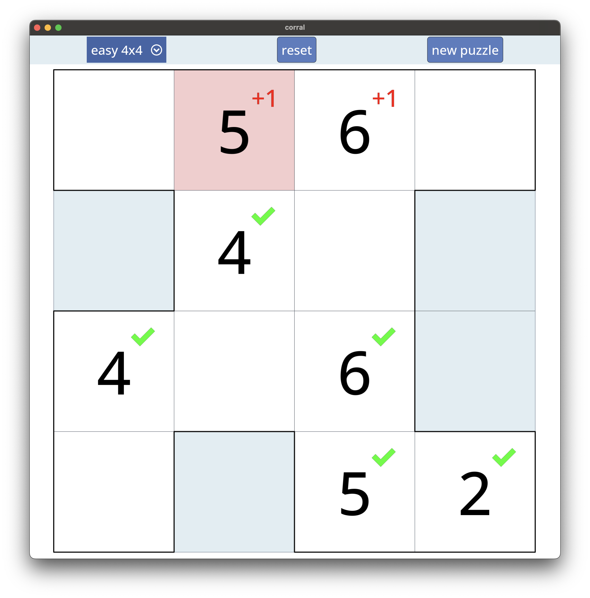

# Coral Puzzle Game

a logic puzzle where the player colors in grid cells to form a loop that satisfies visibility rules based on numbered cells. [Wikipedia explanation](https://en.wikipedia.org/wiki/Bag_(puzzle)).

👉  **[playable demo](https://mohammed321.github.io/projects/corral_web/index.html)**

## screenshot


## Building:
```
git clone --recursive git@github.com:mohammed321/corral.git
cd corral
cmake -S . -B build
cmake --build build
```

## running
```
cmake --build build --target run
```
